# Baycel Grocery Store Management System
## Complete System Workflow

---

## Table of Contents
1. [System Overview](#system-overview)
2. [Main Login Flow](#main-login-flow)
3. [RFID Attendance Process](#rfid-attendance-process)
4. [Employee/HR Management](#employeehr-management)
5. [Attendance Module](#attendance-module)
6. [Inventory Management](#inventory-management)
7. [Delivery Receiving Process](#delivery-receiving-process)
8. [Payroll Process](#payroll-process)
9. [Role-Based Dashboards](#role-based-dashboards)

---

## System Overview

### Tech Stack
| Component | Technology |
|-----------|------------|
| Frontend | Flutter (Dart) - Web + Mobile |
| Backend | Firebase (Cloud) |
| Database | Cloud Firestore |
| Authentication | Firebase Auth |
| Hardware | ESP32 RFID Reader |
| Connectivity | WiFi (Store Network) |

### Architecture Diagram

```
┌─────────────────────────────────────────────────────────────────┐
│                        BAYCEL SYSTEM                            │
├─────────────────────────────────────────────────────────────────┤
│                                                                 │
│   ┌──────────┐      ┌──────────┐      ┌──────────────────┐    │
│   │  ESP32   │      │  Router  │      │    Firebase       │    │
│   │  RFID    │─────▶│  (WiFi)  │─────▶│    ┌────────┐    │    │
│   │  Reader  │      │          │      │    │Firestore│    │    │
│   └──────────┘      └──────────┘      │    └────────┘    │    │
│                                        │    ┌────────┐    │    │
│                                        │    │  Auth   │    │    │
│                                        │    └────────┘    │    │
│                                        └────────┬─────────┘    │
│                                                 │              │
│                                        ┌────────▼─────────┐    │
│                                        │   Flutter App     │    │
│                                        │   (Web + Mobile)  │    │
│                                        └──────────────────┘    │
└─────────────────────────────────────────────────────────────────┘
```

### User Roles

| Role | Access Level |
|------|--------------|
| Owner | Full access to all modules |
| Manager | Inventory, Delivery, Attendance (view), HR (view), Reports |
| Cashier | Sales submission, Own attendance |
| Bagger | Own attendance, Absence forms |
| Bodegero | Inventory, Delivery receiving, Own attendance |
| Delivery Checker | Inventory, Delivery, Own attendance |
| Merchandiser | Stock-out for handled products, Own attendance |

---

## Main Login Flow

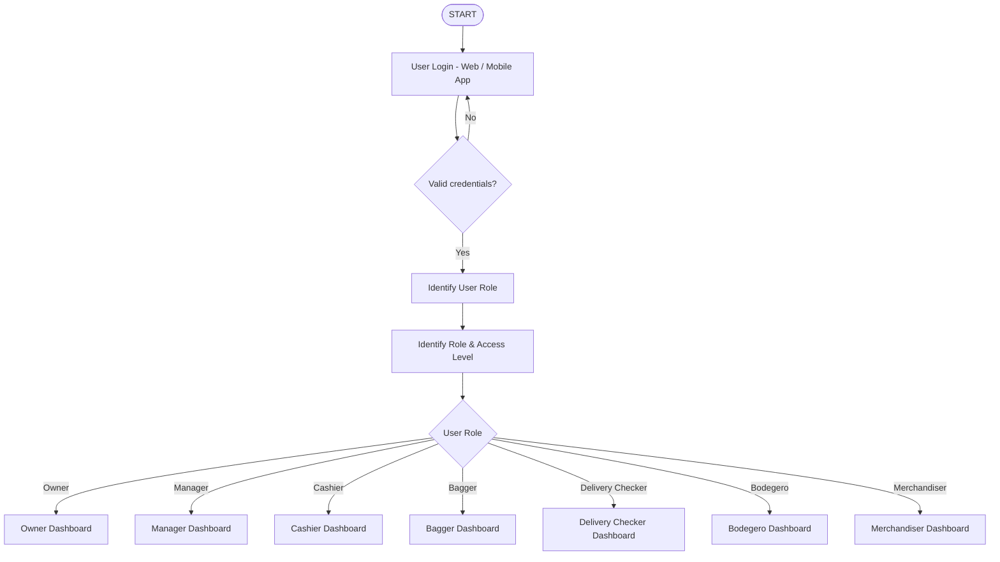

### Login Process
1. User opens Flutter app (Web or Mobile)
2. Enters email and password
3. Firebase Auth validates credentials
4. System retrieves user role from Firestore
5. Routes to appropriate dashboard based on role

---

## RFID Attendance Process

### System Flow

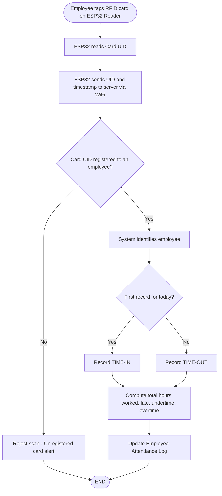

### Attendance Data Structure

```javascript
// Firestore Collection: /attendance/{recordId}
{
  employeeId: "uid123",
  date: "2024-01-15",
  timeIn: "08:00:00",
  timeOut: "17:00:00",
  totalHours: 9,
  lateMinutes: 0,
  undertimeMinutes: 0,
  overtimeHours: 1,
  status: "complete" // "in-progress" if no time-out yet
}
```

### Time Computation Rules

| Metric | Calculation |
|--------|-------------|
| Total Hours | timeOut - timeIn |
| Late | Minutes past scheduled start (e.g., 8:00 AM) |
| Undertime | Minutes before scheduled end (e.g., 5:00 PM) |
| Overtime | Hours worked past 8 hours |

---

## Employee/HR Management

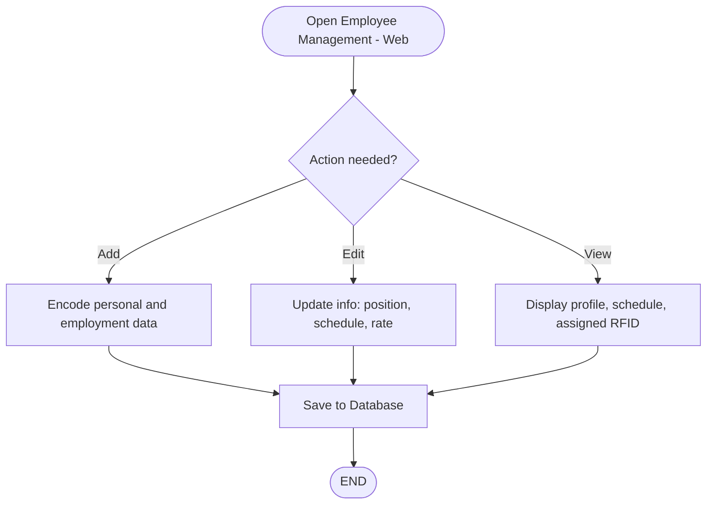

### Employee Data Structure

```javascript
// Firestore Collection: /users/{uid}
{
  name: "Juan Dela Cruz",
  email: "juan@example.com",
  role: "cashier", // owner, manager, cashier, bagger, bodegero, delivery_checker, merchandiser
  position: "Senior Cashier",
  rate: 550, // daily rate in pesos
  schedule: {
    start: "08:00",
    end: "17:00"
  },
  rfidCardUID: "AB:CD:12:34",
  assignedProducts: [], // for merchandiser
  createdAt: timestamp,
  updatedAt: timestamp
}
```

### Role Permissions

| Role | Can Manage |
|------|------------|
| Owner | All employees |
| Manager | View only |
| Others | Self only |

---

## Attendance Module

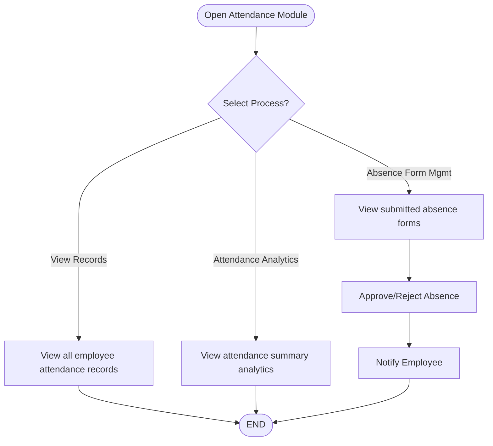

### Attendance Features

| Feature | Description | Access |
|---------|-------------|--------|
| View Records | Filter by date, employee, status | Manager, Owner |
| Analytics | Summary of hours, late, absences | Manager, Owner |
| Absence Forms | Submit/approve absence requests | All (submit), Manager/Owner (approve) |

### Absence Form Structure

```javascript
// Firestore Collection: /absence_forms/{formId}
{
  employeeId: "uid123",
  date: "2024-01-15",
  reason: "Medical appointment",
  status: "pending", // "pending", "approved", "rejected"
  approvedBy: null,
  createdAt: timestamp
}
```

---

## Inventory Management

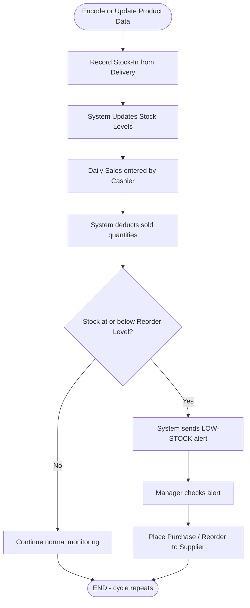

### Product Data Structure

```javascript
// Firestore Collection: /products/{productId}
{
  name: "Rice 5kg",
  category: "Rice & Grains",
  price: 280,
  barcode: "1234567890123",
  reorderLevel: 10, // alert when stock <= this
  currentStock: 25,
  unit: "packs",
  imageUrl: "https://...",
  createdAt: timestamp,
  updatedAt: timestamp
}
```

### Stock Movement Structure

```javascript
// Firestore Collection: /stock_movements/{movementId}
{
  productId: "product123",
  type: "IN", // "IN" (delivery), "OUT" (sale), "ADJUSTMENT"
  quantity: 50,
  performedBy: "uid456", // bodegero or cashier
  reference: "DEL-2024-001", // delivery reference or sale reference
  timestamp: timestamp,
  notes: "Supplier delivery"
}
```

### Inventory Operations

| Operation | Trigger | Performed By | Effect |
|-----------|---------|--------------|--------|
| Stock-In | Delivery received | Bodegero, Delivery Checker | +quantity to currentStock |
| Stock-Out | Daily sales | Cashier | -quantity from currentStock |
| Transfer | Shelf to Bodega | Bodegero | Move between locations |
| Adjustment | Physical count | Manager, Owner | Correct discrepancies |
| Low-Stock Alert | Stock ≤ reorderLevel | System | Notification to Manager |

---

## Delivery Receiving Process

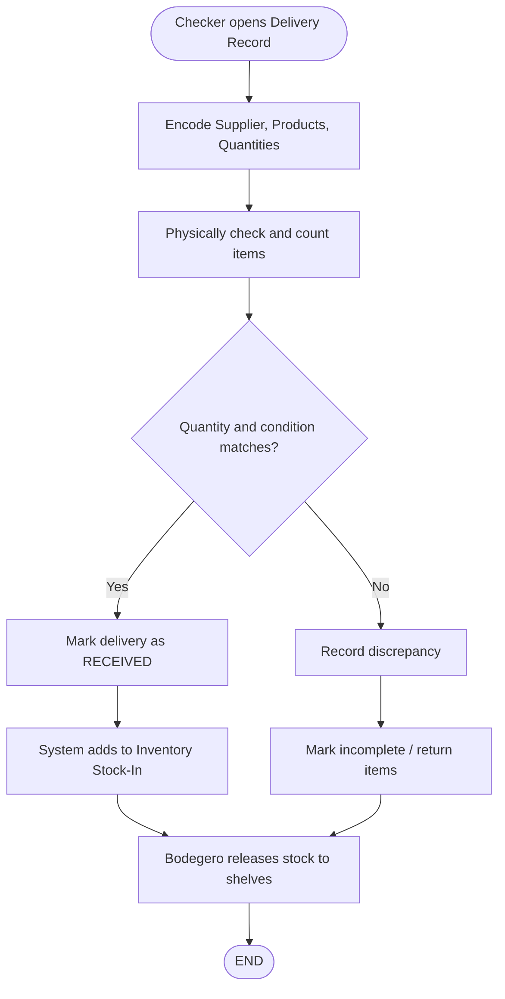

### Delivery Record Structure

```javascript
// Firestore Collection: /deliveries/{deliveryId}
{
  supplierName: "Fresh Produce Co.",
  deliveryDate: "2024-01-15",
  checkerId: "uid789", // delivery checker
  status: "received", // "pending", "in-progress", "received", "incomplete"
  items: [
    {
      productId: "product123",
      expectedQty: 50,
      receivedQty: 48,
      condition: "good",
      discrepancy: "2 units damaged"
    }
  ],
  totalAmount: 14000,
  createdAt: timestamp
}
```

### Delivery Process Steps

1. **Checker** creates delivery record
2. **Checker** encodes supplier, products, expected quantities
3. **Checker** physically inspects and counts items
4. **Checker** marks as received or records discrepancy
5. **System** automatically updates inventory (stock-in)
6. **Bodegero** transfers stock from bodega to shelves

---

## Payroll Process

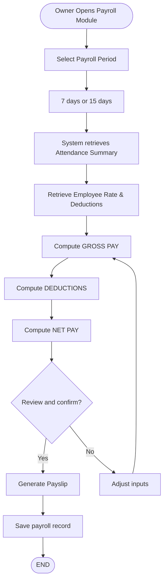

### Payroll Calculation

| Component | Formula |
|-----------|---------|
| Basic Pay | Days worked × Daily rate |
| Overtime Pay | Overtime hours × (Daily rate / 8) × 1.25 |
| **Gross Pay** | Basic Pay + Overtime Pay |
| Late Deduction | (Late minutes / 60) × (Daily rate / 8) |
| Undertime Deduction | (Undertime minutes / 60) × (Daily rate / 8) |
| SSS | Based on salary bracket |
| PhilHealth | 2.75% of basic salary |
| Pag-IBIG | 1-2% of basic salary |
| Tax | Based on BIR tax table |
| **Net Pay** | Gross Pay - All Deductions |

### Payslip Structure

```javascript
// Firestore Collection: /payrolls/{payrollId}
{
  employeeId: "uid123",
  period: "2024-01-01 to 2024-01-15",
  daysWorked: 10,
  dailyRate: 550,
  grossPay: 5500,
  overtimePay: 687.50,
  lateDeduction: 0,
  undertimeDeduction: 0,
  sss: 225,
  philHealth: 151.25,
  pagIbig: 100,
  tax: 0,
  totalDeductions: 476.25,
  netPay: 5711.25,
  status: "pending", // "pending", "confirmed", "paid"
  createdAt: timestamp
}
```

---

## Role-Based Dashboards

### Owner Dashboard

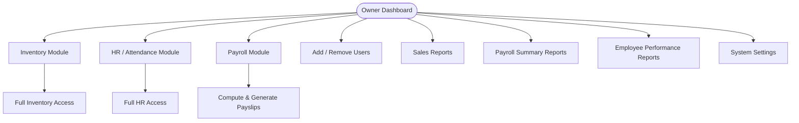

**Owner Capabilities:**
- Full access to all modules
- Add/remove users
- Configure system settings
- View all reports
- Process payroll

---

### Manager Dashboard

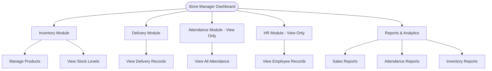

**Manager Capabilities:**
- Manage inventory (add/edit products)
- View deliveries
- View attendance records (all employees)
- View employee information
- Generate reports

---

### Cashier Dashboard

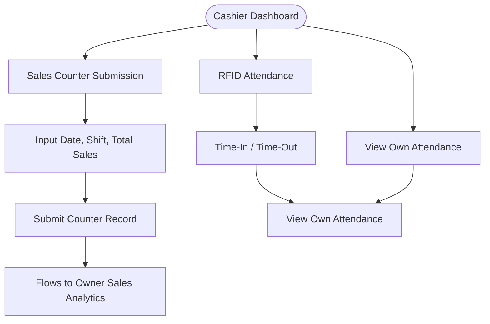

**Cashier Capabilities:**
- Submit daily sales totals
- RFID attendance (time-in/out)
- View own attendance records

---

### Bagger Dashboard

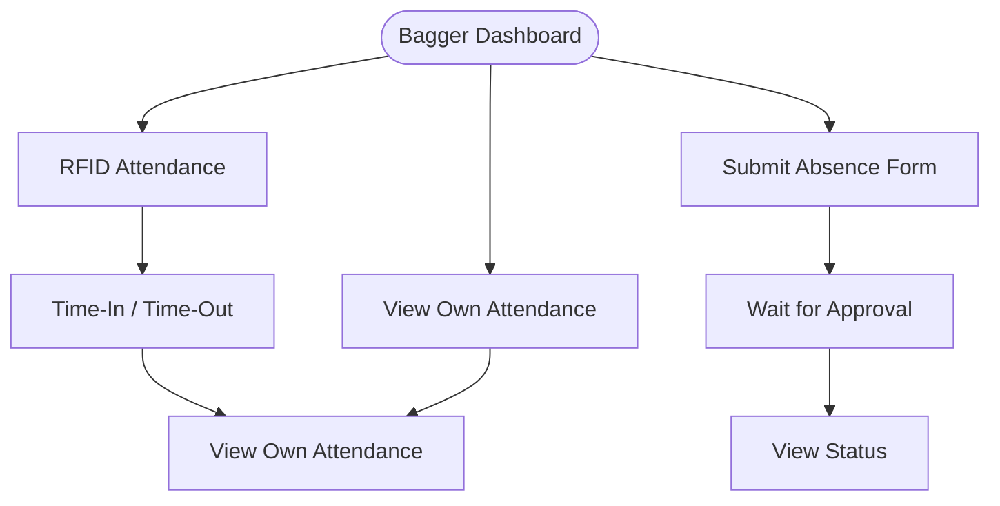

**Bagger Capabilities:**
- RFID attendance (time-in/out)
- Submit absence forms
- View own attendance

---

### Bodegero Dashboard

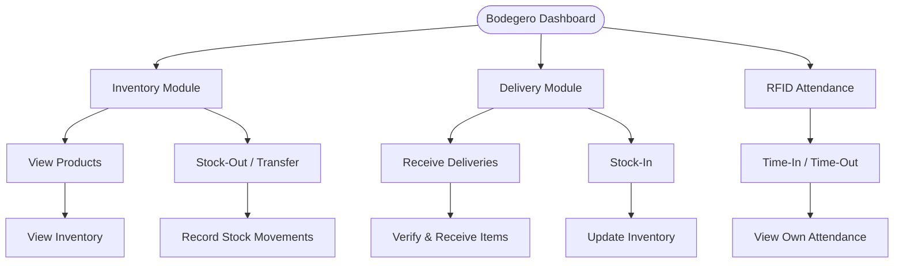

**Bodegero Capabilities:**
- View inventory
- Perform stock-out (pull from bodega to shelves)
- Receive deliveries
- Stock-in delivered items
- RFID attendance

---

### Delivery Checker Dashboard

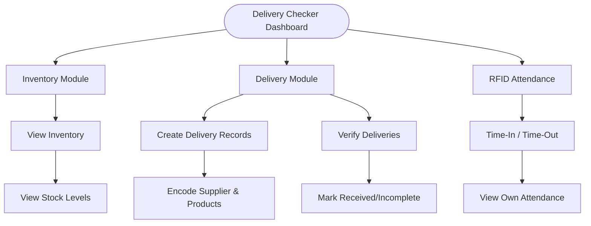

**Delivery Checker Capabilities:**
- View inventory levels
- Create delivery records
- Verify and receive deliveries
- Record discrepancies
- RFID attendance

---

### Merchandiser Dashboard

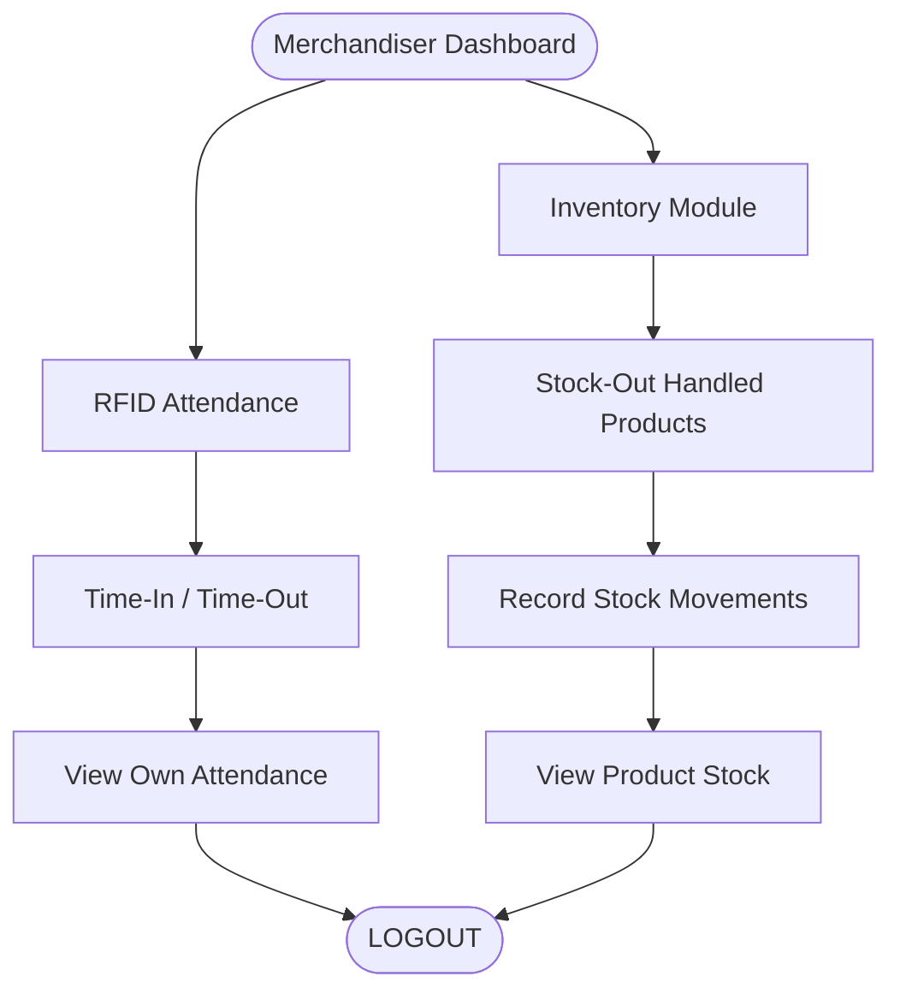

**Merchandiser Capabilities:**
- Stock-out for assigned products only
- View own attendance

---

## Data Flow Summary

### Inventory Data Flow

```
┌─────────────────────────────────────────────────────────────┐
│                    INVENTORY DATA FLOW                       │
├─────────────────────────────────────────────────────────────┤
│                                                              │
│  DELIVERY RECEIVING                                          │
│  ┌──────────┐    ┌──────────┐    ┌──────────┐              │
│  │ Supplier │───▶│ Delivery │───▶│ Inventory│              │
│  │ Delivers │    │ Checker  │    │ Stock-In │              │
│  └──────────┘    └──────────┘    └──────────┘              │
│                                                              │
│  SALES PROCESS                                               │
│  ┌──────────┐    ┌──────────┐    ┌──────────┐              │
│  │ Customer │───▶│ Cashier  │───▶│ Inventory│              │
│  │ Purchases│    │ Records  │    │ Stock-Out│              │
│  └──────────┘    └──────────┘    └──────────┘              │
│                                                              │
│  STOCK MONITORING                                            │
│  ┌──────────┐    ┌──────────┐    ┌──────────┐              │
│  │ System   │───▶│ Low-Stock│───▶│ Manager  │              │
│  │ Checks   │    │ Alert    │    │ Reorders │              │
│  └──────────┘    └──────────┘    └──────────┘              │
│                                                              │
└─────────────────────────────────────────────────────────────┘
```

### Attendance Data Flow

```
┌─────────────────────────────────────────────────────────────┐
│                   ATTENDANCE DATA FLOW                       │
├─────────────────────────────────────────────────────────────┤
│                                                              │
│  ┌──────────┐    ┌──────────┐    ┌──────────┐              │
│  │ Employee │───▶│  ESP32   │───▶│ Firestore│              │
│  │ Taps RFID│    │  Reader  │    │          │              │
│  └──────────┘    └──────────┘    └──────────┘              │
│                                          │                   │
│                                          ▼                   │
│                                   ┌──────────┐              │
│                                   │ Payroll  │              │
│                                   │ System   │              │
│                                   └──────────┘              │
│                                                              │
└─────────────────────────────────────────────────────────────┘
```

---

## Firestore Collections Overview

```
Firestore Database
├── /users/{uid}
├── /products/{productId}
├── /stock_movements/{movementId}
├── /deliveries/{deliveryId}
├── /attendance/{recordId}
├── /absence_forms/{formId}
├── /payrolls/{payrollId}
└── /settings/{configId}
```

---

## Security Rules Summary

| Collection | Owner | Manager | Others |
|------------|:-----:|:-------:|:------:|
| /users | R/W | R | R (self) |
| /products | R/W | R/W | R |
| /stock_movements | R/W | R/W | R (self) |
| /deliveries | R/W | R/W | R/W (own) |
| /attendance | R/W | R | R (self) |
| /absence_forms | R/W | R/W | R (self) |
| /payrolls | R/W | R | R (self) |

**R** = Read, **W** = Write

---

## Implementation Priority

| Priority | Module | Est. Time |
|:--------:|--------|-----------|
| 1 | Firebase Setup + Auth | 2-3 days |
| 2 | Product CRUD (Inventory) | 3-4 days |
| 3 | Stock Movement Logic | 2-3 days |
| 4 | Delivery Receiving | 2-3 days |
| 5 | Attendance Module | 3-4 days |
| 6 | Employee/HR Management | 2-3 days |
| 7 | Payroll Module | 3-4 days |
| 8 | Reports & Analytics | 3-4 days |
| **Total** | | **20-28 days** |

---

*Last Updated: January 2024*
*Project: Baycel Grocery Store Management System*
